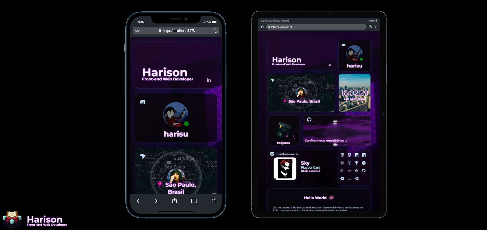
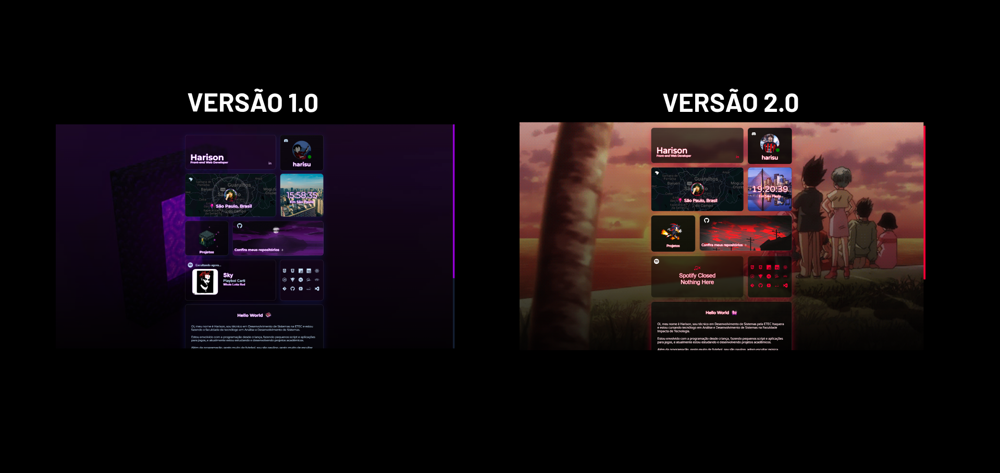

# Portfólio - Harison Rios 💻

> Imagem Hari - Portifolio para Web

> Imagem Hari - Portifolio para Dispositivos Mobile e Tablets

> Imagem Hari - Versões anteriores do Projeto

## Ajustes e melhorias

O projeto ainda está em desenvolvimento e as próximas atualizações serão voltadas nas seguintes tarefas:

- [ ] Aba Projetos.
- [ ] Melhorias no sistema de envio de email.
- [ ] Melhorias no reloader (Mostar apenas reloder caso seja a primeira vez q o user entrar no portifolio.)
- [x] Criação do card do curriculo
- [x] Criação do card da temperatura (baseado em Widgets)  
- [x] Melhorias no card do spotify (responsividade)

## Tecnologias

      
 
## API

Usei essa API no projeto, quiser saber mais sobre aqui esta o github dela : https://github.com/phineas/lanyard

## 📝 Licença

Esse projeto está sob licença. Veja o arquivo [LICENÇA](LICENSE.md) para mais detalhes.
